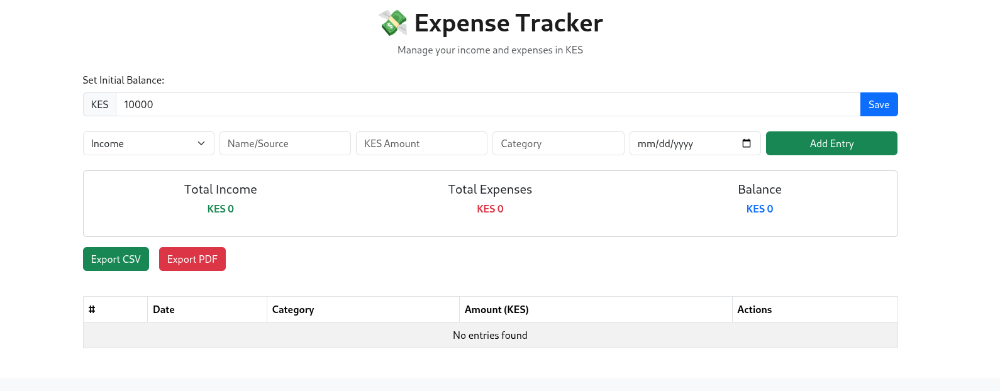
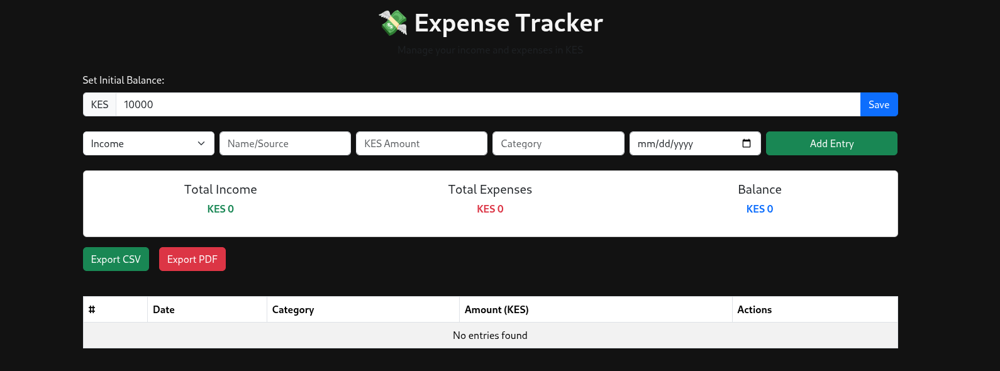

# React Expense Tracker

A responsive, modular Expense Tracker built in React using Vite, Bootstrap, Context API, and localStorage. Features include:

- Transaction CRUD with real-time edits  
- Filter by category and date range  
- Light/Dark mode toggle with persistence  
- CSV and PDF export support  
- Mobile-first layout with scrollable modals  
- Bootstrap-powered UI with tooltips and icons  

---

## Tech Stack

| Technology          | Purpose                                  |
|---------------------|-------------------------------------------|
| React + Vite        | Fast development, modular components      |
| Bootstrap           | Responsive design, styling, tooltips      |
| Context API         | Global state management                   |
| localStorage        | Client-side persistence                   |
| react-csv           | CSV export functionality                  |
| jspdf + html2canvas | PDF export from DOM elements              |

---
..
## Features

### Transaction CRUD
- Add, edit, and delete entries with scrollable modal forms  
- Data validation via controlled inputs  
- LocalStorage-backed updates  

### Filtering
- Dropdown filter by category  
- Toggle to view transactions from last 7 days  

### Theme Toggle
- Light/Dark mode toggle stored in localStorage  
- Floating theme pill button for mobile access  

### Responsive UX
- Bootstrap grid for clean mobile rendering  
- Modals optimized with `scrollable` prop  
- Accessible buttons with `bi` icons + tooltips  

### Export Tools
- One-click CSV export via `react-csv`  
- PDF export via DOM capture (`jspdf` + `html2canvas`)  
- Export scoped to current filtered data  

---

---

## Screenshots

Here are a few highlights from the Expense Tracker in action:

| Light Mode | Dark Mode |
|------------|-----------|
|  |  |

> More screenshots available in the `/screenshots` folder:
- Transaction modal with edit state  
- Category filter in action  
- Export buttons with responsive layout  

---

## Prerequisites

To run this project locally, ensure you have:

- **Node.js** ≥ 16  
- **Vite** globally installed (or use `npx vite`)  
- Compatible browsers: Chrome, Firefox, Edge  
- CLI tools: `yarn`  
- Optionally: PDF viewer for exported files 

## Quick Start

```
git clone https://github.com/your-username/expense-tracker
cd expense-tracker
yarn install
yarn dev
```

Make sure to install:
```
yarn add react-csv jspdf html2canvas bootstrap bootstrap-icons
```
---
## Educational Touch
This codebase includes:

- Fully commented modular components

- Reproducible filtering and export logic

- Context-based global state for easy scalability

- Scaffold-ready for use in student projects or investor demos

---

## Folder Structure

```
src/
├── components/
│   ├── EditTransactionModal.jsx
│   ├── TransactionTable.jsx
│   └── ThemeToggle.jsx
├── context/
│   └── TransactionContext.jsx
├── pages/
│   └── TransactionPage.jsx
├── App.jsx
└── index.css
```
---
## Coming Soon

> Toast alerts for actions

> Dynamic category manager

> Backend integration or auth

> Chart-based analytics


---

## Creator

Built by **Zablon**, a visionary React developer and educator focused on reproducibility, modular design, and clean UI/UX.  
> For collaboration or inquiries: [Talk to me](https://github.com/Zambagarrah)
